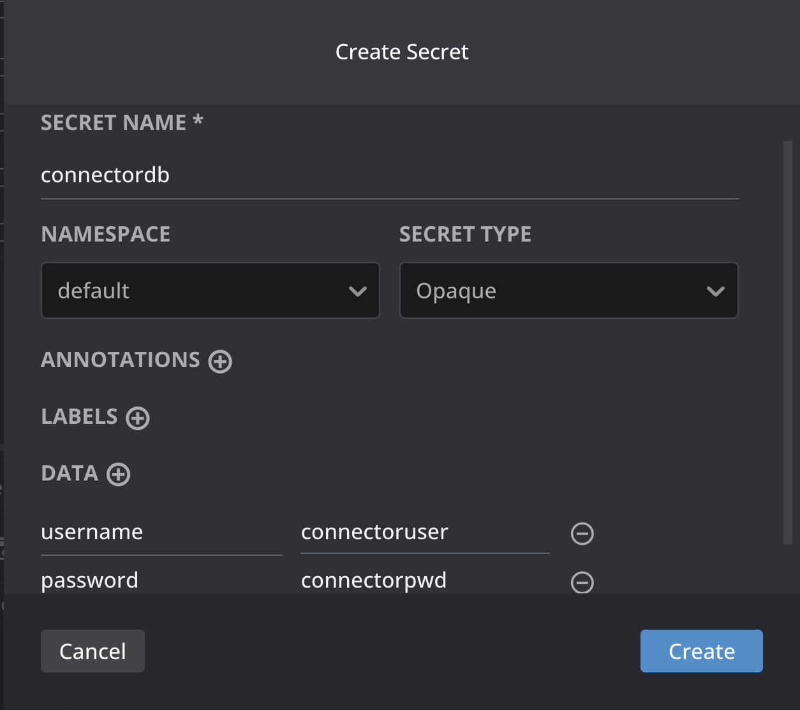
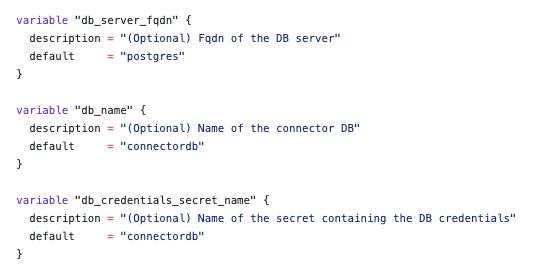

# Database configuration

PostgreSQL is the only supported database so far, as it is integrated with EDC.

## Prerequisites

- Ensure that a PostgreSQL database is running and accessible so the connector can connect to it.

- Create a Kubernetes secret for the connector to access the database. This step can be skipped if PostgreSQL is deployed locally using the procedure outlined in “Setting up PostgreSQL in local”.

    - The secret must contain username and password.



## Setting up PostgreSQL in local

> This setup is required only when deploying the connector locally. Do not use Terraform to deploy the PostgreSQL database server in a production environment.


Under [EonaX-Shared-Resources repo](https://github.com/AmadeusITGroup/EonaX-Shared-Resources/tree/main), go to deployment/storage folder and execute the below command to start postgreSQL server along with HashiCorp vault.

```
terraform init
terraform apply -auto-approve
```

After setting up PostgreSQL locally, you will have the following details:

- db_server_fqdn: postgresql 

- username, password : stored in the Kubernetes secret with the name connectordb

- database name: connectordb


These details ensure that the connector can connect to the database successfully.

## Configuring database details in the connector

The following connector components require a database connection:

- Control Plane

- Identity Hub

- Data Plane

> Even if multiple components need access to the database, the configuration only needs to be defined once.

To set it up, [EonaX-Shared-Resources repo](https://github.com/AmadeusITGroup/EonaX-Shared-Resources/tree/main), either:

- Go to deployment/connector and update the [variables.tf](https://github.com/AmadeusITGroup/EonaX-Shared-Resources/blob/main/deployment/connector/variables.tf) file by replacing the default values:

    - db_server_fqdn - the fully qualified domain name of the database server, for example, postgresql or postgresql.production.com.

    - db_name – the name of the database, for example, connectordb

    - db_credentials_secret_name – the Kubernetes secret name, for example, connectordb created during the prerequisite step

        

- or provide values through a .tfvars file for easier management and reuse.

    ```
    # terraform.tfvars

    # Fully qualified domain name of the database server
    db_server_fqdn = "postgresql"
    #db_server_fqdn = "postgresql.production.com"

    # Name of the database
    db_name = "connectordb"

    # Kubernetes secret name containing DB credentials
    db_credentials_secret_name = "connectordb"

    # other configs
    ```

Finally, run the Terraform apply command under deployment/connector:

- If you are not using a .tfvars file:
    ```
    terraform apply -auto-approve
    ```

- If you are using a .tfvars file
    ```
    terraform apply -auto-approve -var-file=terraform.tfvars
    ```